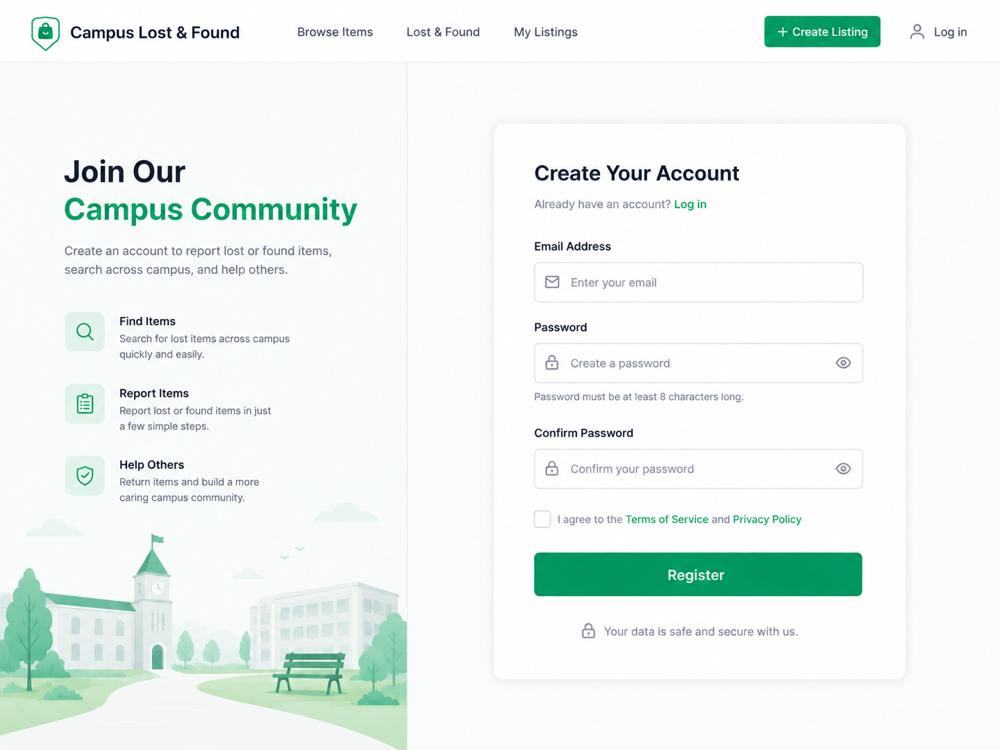
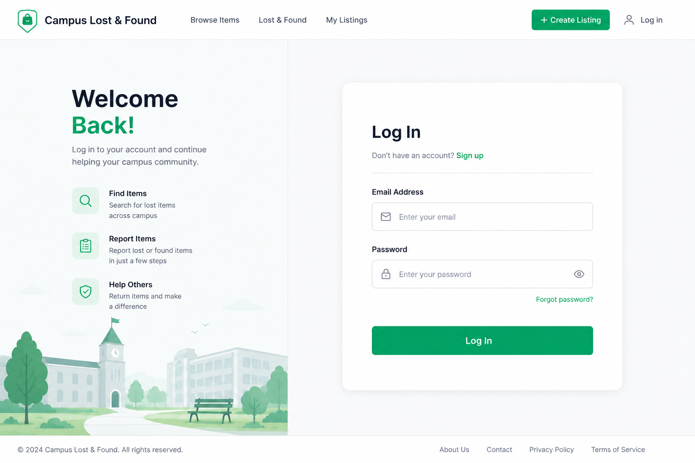
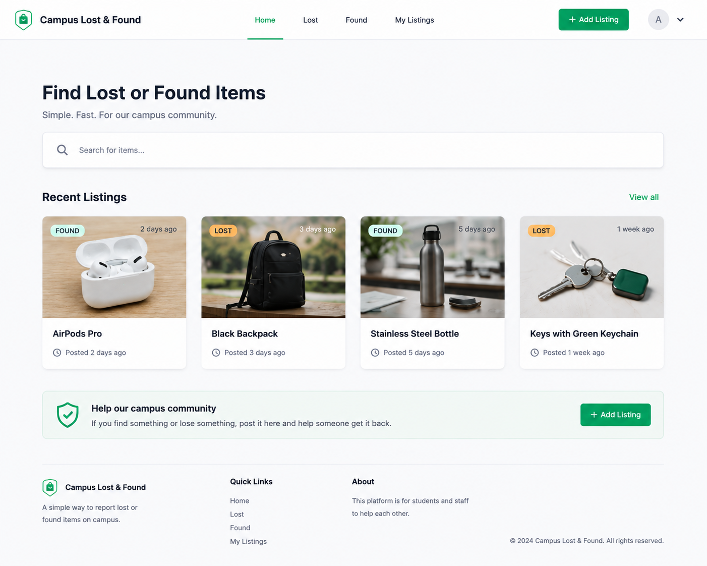
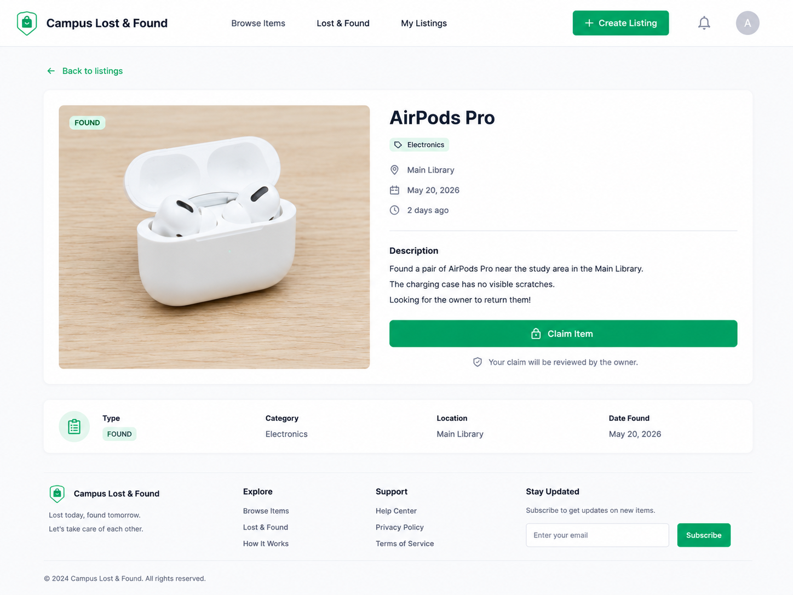
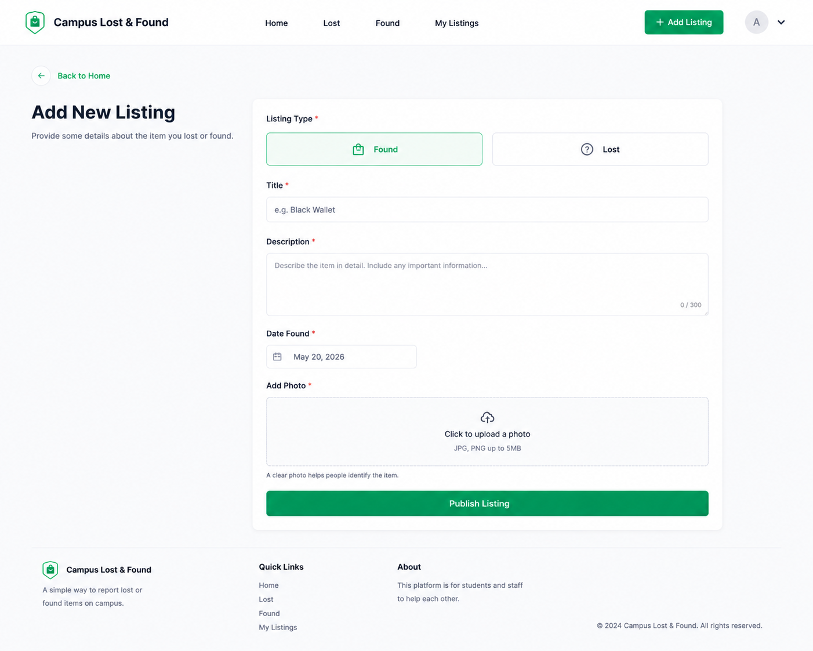
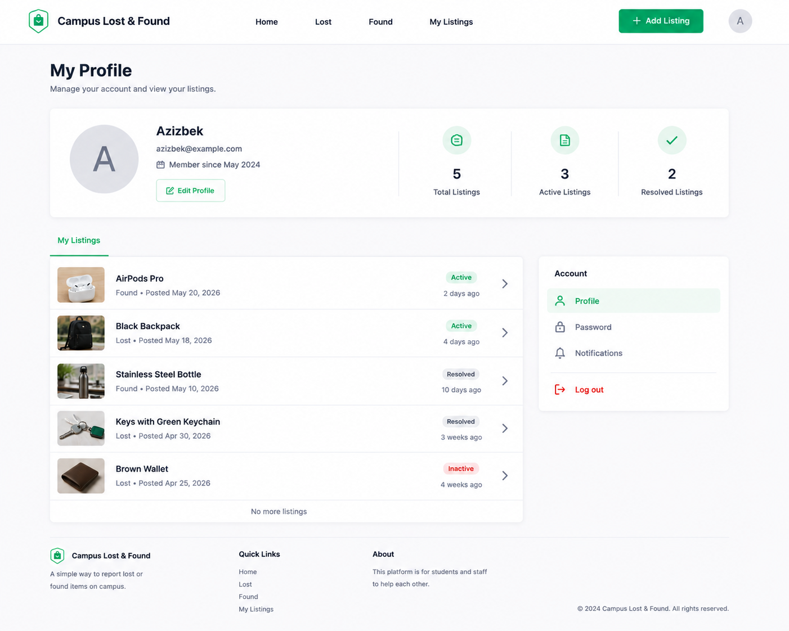

# Campus Lost & Found — Backend

Kampusda yo'qolgan va topilgan buyumlar uchun kichik web app. Siz **faqat backend** yozasiz — frontend dizayni tayyor.

FastAPI asoslarini endi tugatgan o'quvchilar uchun practice loyiha.

---

## Qanday ishlaydi

User ro'yxatdan o'tadi → login qiladi → yo'qolgan yoki topilgan buyum haqida e'lon (listing) joylaydi. Boshqalar e'lonlarni ko'radi, qidiradi va buyum o'ziniki bo'lsa "claim" qiladi.

Ikkita model, xolos:

```text
User  1 ──────── N  Listing
```

Listing `LOST` yoki `FOUND` bo'ladi, `ACTIVE` dan `CLAIMED` ga o'tadi.

---

## Texnologiyalar

| | |
| --- | --- |
| **FastAPI** | API |
| **SQLAlchemy** | ORM |
| **Pydantic** | Validation |
| **PostgreSQL** | Database |
| **passlib + bcrypt** | Parol hash |
| **JWT** | Autentifikatsiya |

---

## Papka strukturasi

Papkalar **modul (feature) bo'yicha** bo'linadi — har bir modul o'z ichida to'liq:

```text
app/
├── main.py
├── database.py
├── core/
│   ├── config.py
│   └── security.py
│
├── users/
│   ├── models.py
│   ├── schemas.py
│   ├── repository.py
│   ├── service.py
│   ├── router.py
│   └── dependencies.py
│
└── listings/
    ├── models.py
    ├── schemas.py
    ├── repository.py
    ├── service.py
    └── router.py
```

Har bir modulda bir xil fayllar:

| Fayl | Nima yoziladi |
| --- | --- |
| `models.py` | SQLAlchemy jadval |
| `schemas.py` | Pydantic request/response |
| `repository.py` | Faqat DB query'lari |
| `service.py` | Biznes qoidalari |
| `router.py` | Endpointlar |

So'rov shu yo'l bilan o'tadi:

```text
router  →  service  →  repository  →  models
```

Batafsil va kod misollari: [ARCHITECTURE.md](ARCHITECTURE.md)

---

## Ekranlar

Har bir ekran ostida — shu sahifa uchun nima yozilishi kerak.

> Dizaynda MVP'ga kirmaydigan elementlar ham bor. Ular "❌" belgisi bilan ko'rsatilgan — ularni **qilmaysiz**.

### 1. Register



`POST /auth/register` — email band bo'lsa `409`. Parol `bcrypt` bilan hash qilinadi, javobda qaytmaydi.

❌ Confirm Password, Terms checkbox, email tasdiqlash

### 2. Login



`POST /auth/login` → token. `GET /auth/me` → token egasi.

Noto'g'ri email yoki parolda `401`. Qaysi biri xato ekanini aytmang.

❌ Forgot password

### 3. Home



`GET /listings` — ochiq endpoint, token kerak emas.

Qidiruv → `?search=airpods` (faqat `title` bo'yicha). Lost/Found tablari → `?type=LOST`. Sahifalash → `?page=1&page_size=20`.

### 4. Detail



`GET /listings/{id}` — topilmasa `404`.

`POST /listings/{id}/claim` — `ACTIVE` → `CLAIMED`, token kerak. Allaqachon claim qilingan bo'lsa `409`.

❌ Category, Location, claim approval, Subscribe

### 5. Add Listing



`POST /listings` — token kerak.

`user_id` request'dan olinmaydi, token'dan olinadi. `status` har doim `ACTIVE` bo'lib yaratiladi. `title` 2–100 belgi, `description` maksimal 300 belgi.

### 6. Profile / My Listings



`GET /me/listings` — faqat token egasining e'lonlari.

`PATCH /listings/{id}` va `DELETE /listings/{id}` — faqat e'lon egasiga, aks holda `403`.

❌ Edit Profile, parol o'zgartirish, Notifications, statistika, `Resolved`/`Inactive` statuslar

---

## Hujjatlar

| Fayl | Nima bor |
| --- | --- |
| [ARCHITECTURE.md](ARCHITECTURE.md) | Modullar, qatlamlar, qaysi kod qayerga yoziladi |
| [API.md](API.md) | Endpointlar, request/response, xatolik kodlari |
| [DATABASE.md](DATABASE.md) | Jadvallar, ustunlar, bog'lanishlar |
| [postman_collection.json](postman_collection.json) | Postman'ga import qilib sinash uchun |

---

## Ishga tushirish

PostgreSQL o'rnatilgan va ishga tushgan bo'lishi kerak. Database yarating:

```bash
createdb foundly
```

Keyin loyihani:

```bash
python -m venv venv && source venv/bin/activate
pip install -r requirements.txt
cp .env.example .env
uvicorn app.main:app --reload
```

http://localhost:8000/docs ni oching.

`requirements.txt`:

```text
fastapi
uvicorn[standard]
sqlalchemy
psycopg2-binary
pydantic[email]
pydantic-settings
passlib[bcrypt]
bcrypt==4.0.1
python-jose[cryptography]
python-dotenv
```

> `bcrypt` versiyasi ataylab qotirilgan. `passlib` yangi bcrypt (4.1+) bilan `error reading bcrypt version` xatosini beradi.

---

## Ish tartibi

1. Setup, papkalar, `main.py` ishga tushsin
2. `database.py` + `users/models.py`
3. Register / Login / `/auth/me` → **ekran 1–2**
4. `listings/models.py`
5. Listing yaratish → **ekran 5**
6. Ro'yxat + qidiruv → **ekran 3**
7. Detail + claim → **ekran 4**
8. My listings + ownership → **ekran 6**
9. Testlar

Har bir endpointni **pastdan yuqoriga** yozing: avval `repository.py`, keyin `service.py`, oxirida `router.py`.

---

## Tayyor deb hisoblanadi, agar

* [ ] Register va login ishlasa
* [ ] Login qilgan user e'lon yarata olsa
* [ ] E'lonlar ro'yxati va bitta e'lon ochilsa
* [ ] `?search=` title bo'yicha qidirsa
* [ ] User o'z e'lonlarini ko'ra, tahrirlay va o'chira olsa
* [ ] Begona e'lonni tahrirlashda `403` qaytsa
* [ ] Claim ishlasa, ikkinchi marta `409` qaytsa
* [ ] Parollar hash qilingan bo'lsa
* [ ] Asosiy endpointlarga testlar yozilgan bo'lsa

---

## QILINMAYDI

Google/Apple OAuth, email tasdiqlash, parol tiklash, chat, WebSocket, notification, Celery, Redis, Elasticsearch, admin panel, to'lov, AI matching.

> Maqsad — ko'p texnologiya ishlatish emas. Maqsad — `User` va `Listing` orqali ishonchli ishlaydigan API yozish.
